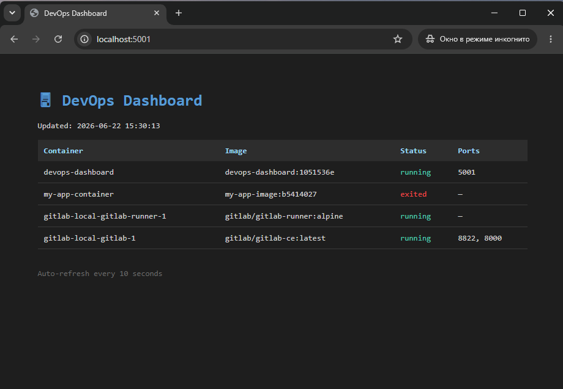

# DevOps Dashboard

A lightweight container monitoring dashboard built to demonstrate core DevOps skills.

## 🖥 Demo

> Dashboard auto-refreshes every 10 seconds and displays all running Docker containers.



## 🛠 Tech Stack

| Tool | Purpose |
|------|---------|
| Python / Flask | Web application |
| Docker | Containerization |
| Docker Compose | Multi-container orchestration |
| GitLab CI/CD | Automated pipeline (test → build → deploy) |
| GitLab Runner | Self-hosted CI executor |

## 🏗 Architecture
Git Push

│

▼

GitLab CI/CD Pipeline

├── test   → installs dependencies, checks imports

├── build  → builds Docker image

└── deploy → stops old container, runs new one

│

▼

DevOps Dashboard

(Flask + Docker SDK)

│

▼

Reads Docker socket → shows

all containers, status, ports
## 🚀 Quick Start

**Requirements:** Docker, Docker Compose

```bash
git clone <your-repo-url>
cd devops-dashboard
docker compose up --build
```

Open http://localhost:5001

## 📁 Project Structure
devops-dashboard/

├── app/

│   ├── app.py              # Flask application

│   └── requirements.txt    # Python dependencies

├── Dockerfile              # Container image definition

├── docker-compose.yml      # Local development setup

├── .gitlab-ci.yml          # CI/CD pipeline

└── README.md

## ⚙️ CI/CD Pipeline

Every `git push` triggers the pipeline:

1. **test** — verifies all dependencies install correctly
2. **build** — builds Docker image tagged with commit SHA
3. **deploy** — replaces running container with new image

## 📌 What I Learned

- Setting up a self-hosted GitLab instance with Docker Compose
- Configuring and registering GitLab Runner
- Writing multi-stage CI/CD pipelines
- Using Docker SDK for Python to inspect containers at runtime
- Debugging Docker networking between containers
